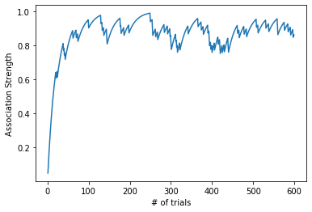

Homework 2

Problem 1a


```python
import numpy as np
import matplotlib.pyplot as plt
times = np.arange(1,21)
current_ass = 0.05
v_values = []
alpha_light = 0.5
learning_rate = 0.1

for t in times:
    delta = learning_rate*alpha_light*(1-current_ass)
    current_ass = current_ass + delta
    v_values = np.append(v_values,current_ass)
    #if current_ass >= .8:
        #print(current_ass,t)

plt.scatter(times,v_values)
plt.xlabel('# pairings btwn light and food')
plt.ylabel('Association strength: starting at 0.05')
plt.title('Association strength over pairings')
plt.grid()
plt.show()

#20 trials means there should be 20 diff ticks on the x axis and there will be 20 association strengths, one for each one.
times = np.arange(1,21)
current_ass = 0.5
v_values = []
alpha_light = 0.5
learning_rate = 0.1
for t in times:
    delta = learning_rate*alpha_light*(1-current_ass)
    current_ass = current_ass + delta
    v_values = np.append(v_values,current_ass)
plt.scatter(times,v_values)
plt.xlabel('# pairings btwn light and food')
plt.ylabel('Association strength: starting at 0.5')
plt.title('Association strength over pairings')
plt.grid()
plt.show() 

```


Problem 1b:
It will take 30 trials to reach a Vlight = 0.8.

Problem 1c:


```python
learning_rate = 0.1
alpha_light = 0.5
salience = np.arange(0.01,2,0.01)
count = 0
for s in salience:
    current_ass = 0
    for i in np.arange(13):
        delta = learning_rate*s*(1-current_ass)
        current_ass = current_ass + delta
        if current_ass > 0.8 and count == 0:
            print(s)
            count+=1
            break

```

    1.17


The salience would be 1.17. Looping through possible salience values and stopping when the current_association value is > 0.8 gives us this answer.

Problem 2


```python
times = np.arange(1,21)
v_values = []
bell_ass = 0.0
alpha_bell = 0.2
alpha_light = 0.5
learning_rate = 0.1
ass_light = 0.8
for t in times:
    delta = learning_rate*alpha_bell*(1-(ass_light + bell_ass))
    bell_ass = bell_ass + delta
    ass_light = ass_light + delta
    v_values.append(bell_ass)

    
plt.scatter(times,v_values)
plt.xlabel('# pairings btwn bell, light, food')
plt.ylabel('Association strength')
plt.title('Association strength btwn bell and food')
plt.show()
    

```


Problem 3a


```python
times = np.arange(20)
ass_str_over_time = []
curr_ass_str = 0.0
learning_rate = 0.1
count = 0
bell_sal = 0.75

for t in times:
    delta = bell_sal*learning_rate*(1-curr_ass_str)
    curr_ass_str = curr_ass_str + delta
    ass_str_over_time.append(curr_ass_str)
    down = bell_sal*learning_rate*(0-curr_ass_str)
    curr_ass_str = curr_ass_str + down
    ass_str_over_time.append(curr_ass_str)

trial_num = np.arange(40)
plt.plot(trial_num,ass_str_over_time)
plt.xlabel('# times trained')
plt.ylabel('Association Strength')
plt.title('Association Strength with alternating learning/extinction')
plt.show()
```


The graph continually increases, but the back and forth causes the association strength to increase and decrease in each step. Each time the pairing is bell + no food, the patient has a decreased association strength for bell + food. The bell + food association gets extinguished in every other step, to some extent. The graph begins to level off though. It seems to level off around 0.5 association strength, just based on this graph.

Problem 3b


```python
import random
#rand = random.randrange(1,100)
salience = 0.5
learning_rate = 0.1
prob = 0.3
curr_ass = 0
curr_ass_str = []
times = np.arange(1,600)
for t in times:
    rand = np.random.random()
    if rand <= prob:
        delta = salience*learning_rate*(1-curr_ass)
        curr_ass = curr_ass + delta
        curr_ass_str.append(curr_ass)
    else:
        delta = salience*learning_rate*(0-curr_ass)
        curr_ass = curr_ass + delta
        curr_ass_str.append(curr_ass)
#trial_num = np.arange(500)
plt.plot(times,curr_ass_str)
plt.xlabel("# of trials")
plt.ylabel("Association Strength")
plt.show()
    
```


```python
import random
#rand = random.randrange(1,100)
salience = 0.5
learning_rate = 0.1
prob = 0.7
curr_ass = 0
curr_ass_str = []
times = np.arange(1,600)
for t in times:
    rand = np.random.random()
    if rand <= prob:
        delta = salience*learning_rate*(1-curr_ass)
        curr_ass = curr_ass + delta
        curr_ass_str.append(curr_ass)
    else:
        delta = salience*learning_rate*(0-curr_ass)
        curr_ass = curr_ass + delta
        curr_ass_str.append(curr_ass)
#trial_num = np.arange(500)
plt.plot(times,curr_ass_str)
plt.xlabel("# of trials")
plt.ylabel("Association Strength")
plt.show()
```


```python
import random
#rand = random.randrange(1,100)
salience = 0.5
learning_rate = 0.1
prob = 0.9
curr_ass = 0
curr_ass_str = []
times = np.arange(1,600)
for t in times:
    rand = np.random.random()
    if rand <= prob:
        delta = salience*learning_rate*(1-curr_ass)
        curr_ass = curr_ass + delta
        curr_ass_str.append(curr_ass)
    else:
        delta = salience*learning_rate*(0-curr_ass)
        curr_ass = curr_ass + delta
        curr_ass_str.append(curr_ass)
#trial_num = np.arange(500)
plt.plot(times,curr_ass_str)
plt.xlabel("# of trials")
plt.ylabel("Association Strength")
plt.show()
```





The association strength depends on the probability; if the probability "prob" is higher (ie 0.9) that leads to more consistent values for association strength. On the other hand, if it's lower (say 0.3), the strength becomes more varied, and less consistent. This makes sense, because with an increased likelihood of a certain conditioned stimulus to an unconditioned stimulus, there is an increase in association strength.

Problem 4

Although in this model, learning rate and salience as essentially the same, we often think of them as being seperate. Learning rate typically is learner-dependent whereas the salience is more conditioned stimulus-dependent. In order to clearly seperate these properties, we could study individuals' reactions to specific sensory experiences such as smell or noise. With this tactic, a sense could not have been experienced by all learners and therefore salience depends just on the stimulus and learning rate depends solely on the learner's abilities.
